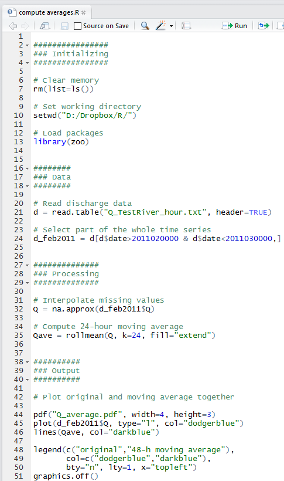
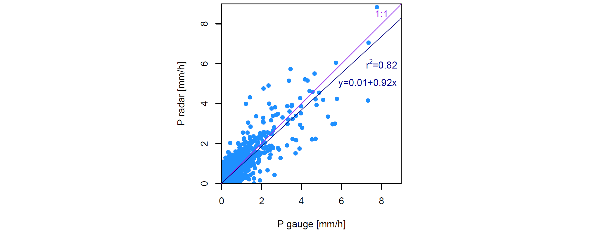

Module 4: Basic plotting
---

In this module, you will build your first complete script from scratch.

&nbsp;

***Introduction***

With the exercises in the next modules you learn how to set up an R script from scratch. The exercises explain step by step how to build your script. The scripts in these exercises always follow the same structure with the following sections:

- **`Initializing`**: Clear memory, set working directory and load packages. 
- **`Data`**: Read data from file and data preprocessing (such as extracting and renaming one column of the total data set).
- **`Processing`**: Do computations, run a model, etc.
- **`Output`**: Make a dataframe and/or figure and save these to file.

Setting the working directory and saving figures to file can also be done by clicking in RStudio. Hard-coding it in your script requires a few more lines of code, but in real projects, it saves time because you often have to rerun scripts, so it's good to make hard-coding these thing a habit.

Before you start, some programming tips:

- Start small.
- Organise your work.
- Add comments (behind #) to your commands (don't overestimate the audience or future-you).
- Run you code (or part of it) every time when you add something, to make sure that it is still working. It is relatively easy to find the error when the code worked before and you just added one line since then.
- Use the references at the end of *A (very) short introduction to R*.
- Copy-paste error messages in Google. You often get hits for StackOverflow, which is a good website with questions and answers on programming (different languages). You can also Google your problem (type R + keyword / problem) and get solutions (functions, packages, code).
- Save the scripts you made as inspiration for your future (thesis) work.  

&nbsp;

***Compare rainfall measurements***

The aim of this exercise is to reproduce the figure below. You will build it in steps. Don't forget to run (part of) the code every time you add something, to check if everything is still error-free.

1. Download the file `P_gauge_radar.dat` and save it on your computer. Make sure that the folders for scripts, input (data files) and output (figures and data files) are logically structured.
2. Start with an empty script. Make the main headers `Initializing`, `Data`, `Processing` and `Output`. Don't forget the #-sign to indicate that they are comments and not commands (see Sec. 5 in *A (very) short introduction to R*).
3. Under `Initializing`, add commands to clear R's memory and set the working directory (see the figure above).
4. Add code to read the data file (under `Data`).
5. Plot the rainfall measured by the radar against rainfall measured by the raingauge. Look up in *A (very) short introduction to R* (Sec. 6.3) how to select columns in a data frame.
6. Add arguments to the `plot` function:
    1. Look in *A (very) short introduction to R* (Sec. 12.1, under Plotting parameters) for the most important plotting parameters. 
    2. Make your points the color `dodgerblue`. Look up which argument you need.
    3. Type *R pch* in Google. Under images, you will find collections of point types. Transform your points into filled circles. 
    4. Make the axis labels the same as in the figure below.
    5. Comparing two similar variables is easier when the $x$ and $y$ ranges are the same (and the figure is square, but you'll do that later). Make the ranges of both axes from 0 to 9.
    6. You can see that R automatically adds some space on the $x$ and $y$ axis. With the arguments `xaxs="i"` and `yaxs="i"`, you remove that space.
7. Some plotting parameters from the `par`-list have to be specified before the `plot` function. 
    1. Type `par(pty="s")` above the `plot`-command to make the figure square.
    2. Type `?par` to see all plotting parameters in the R help and look up `mar`. Add this argument to the `par`-function above the plot. Make the bottom and left margins (space around the plot, where axes and labels are drawn) 4 and the top and right margins 0.5.
8. Add the 1:1-line with the function `curve`:
    1. Type `?curve` to see its arguments. `curve` computes the y value with the equation (which uses the `x` value) specified in the argument `expr`. To compute a 1:1-line, use `expr=1*x`. Add the `curve` function below the `plot` function. 
    2. When you run this line, you see that it makes a new plot window instead of adding the line to the previous plot. Find the argument you need to add the line to the plot (and run `plot` and `curve` again).
    3. Make the line purple.
    4. You see that the line doesn't go all the way from one corner to the other. Specify `xlim` (within `curve`) to make that happen.
9. Compute and plot a regression line:
    1. Google *R linear regression*. There are several pages that explain how to use the function `lm`. You can also type `?lm` in R.
    2. Under `Processing`, type a line of code that fits a linear model and stores the output in a variable (for example called `regr`).
    3. Type `coef(regr)` on the command line. What you get is a vector with two numbers: the intercept and the slope. 
    4. Add a line to the script to extract the intercept from `regr` using `coef` and regular vector indexing (see Sec. 12.1 in *A (very) short introduction to R*, under Extracting data) and call it `a`.
    5. Extract the slope and call it `b`.
    6. Type `summary(regr)` on the command line to see all the output from `lm`. With `summary(regr)$r.squared` you can extract the $r^2$. Add a line to the script to do this and call the result `r2`.
    7. Use the `curve` function again to plot a 
`darkblue` regression line using `a` and `b` (Sec. `Output`). Check if the line is the same as in the figure below.
10. Add text. 
    1. In the section `Output`, below the curves, use the function `text` to add *1:1* in purple on coordinate (`x=8`,`y=8.5`).
    2. Add the equation of the regression line in dark blue on coordinate (7.3,5). Instead of typing the text manually, you can use `paste0("y=",a,"+",b,"x")` to get the correct values of `a` and `b` automatically. This is more work, but safer, because if you rerun the script with different data, the text is updated automatically. `paste0` glues character strings and variables together without space in between.
    3. Add the $r^2$ on coordinate (8,6). Use `bquote(paste("r"^{2},"=",.(r2)))` as text. This code is a bit complex (and you don't have to understand it), but it allows you to have both a superscript and the value of `r2` automatically.
    4. It is not necessary (and a bit messy) to show all digits. Round `a`, `b` and `r2` to 2 decimals. Google *R round numbers* to find out which function to use. Add this function to the commands under `Processing`.
11. Add commands to write the figure to pdf with width 4 and height 4 (inches). You need to add a command to open the pdf (starting with `pdf`, see the example in the figure above) before the plotting commands, and a command to close the pdf afterwards (`graphics.off()`). 

*Comparing rainfall measured with a radar to rainfall measured with a rain gauge. Figure source: C.C. Brauer, A. Overeem, H. Leijnse, R. Uijlenhoet (2016): The effect of differences between rainfall measurement techniques on groundwater and discharge simulations in a lowland catchment, Hydrol. Process., 30, 3885--3900, onlinelibrary.wiley.com/doi/10.1002/hyp.10898/epdf.*

