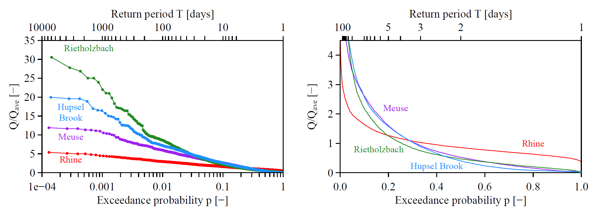

Module 5: Pretty plotting
-------

***Flow duration curve***

The aim of this exercise is to reproduce the figure below. You will build it in steps: starting with one figure (right panel), for one river (Rhine), with one $x$ axis (bottom).

1. Download `Q_day_Rhine_Meuse_Rietholzbach_Hupsel_1989_2007.txt`.
2. Open an empty script and add the headers `Initializing`, `Data`, `Processing` and `Output`.
3. Set the working directory (under `Initializing`).
4. Add lines (under `Data`) to read the data.
5. Make a new vector with the Rhine discharges ordered from high to low (under `Processing`). Divide all discharges in this vector by the mean discharge to get the normalised discharge. Give this vector a logical name. 
6. The rest of the script is part of Section `Output`. Plot the ordered normalised discharges as a red line. The shape should be similar as in the right panel in the figure below.
7. Make a vector with the same length as the ordered Rhine discharges, ranging from 0 to 1. For example, if there would be 11 discharge data points, this new vector would be `c(0, 0.1, 0.2, ..., 1)`. 
8. Modify the plot such that the vector from 0 to 1 is on the $x$-axis and ordered discharge on the $y$-axis.
9. Let the $x$- and $y$-axis ranges match the example.
10. Add the labels on the $x$- and $y$-axes. Google ``Stackoverflow subscripts-in-plots-in-r'' to find out how to get the subscript in $Q_\mathsf{ave}$.
11. Use the function `text` to write `Rhine` in the plot.
12. Repeat steps 5--11 for the other 3 catchments.
13. Google `R color chart` and look up which colors match the example.
14. Use plotting parameters `mar`, `mgp`, `tcl`, and `las` to get the same margins, label locations, tick lengths and text direction. Search `par` in the R help for explanation. You can type `par(mar=...)` above the first plotting command. 
15. Make the $x$-axis on top:
	  1. Type `?axis` to search in the R help which arguments you  need.
  	2. Make a vector with numbers 1, 2, 3, 4, 5, 10 and 100. Divide 1 by this vector (to convert exceedance probability to return period; $T = 1/p$). 
	  3. Use the function `axis` to make the axis on top with tick marks and numbers at return periods 1, 2, 3, 4, 5, 10 and 100. 
	  4. Make a vector from 20 to 90 with steps of 10. Make another vector from 6 to 9 with steps of 1. Combine the vectors. Divide 1 by this vector. 
	  5. Use the function `axis` to make an axis on top with 12 tick marks on the locations of the last vector and no numbers. Use the function `rep` to repeat an empty character string (`""`) 12 times. 
	  6. Add a label for the $x$-axis on top.
16. The right figure is now finished. Copy the code for the figure (except the plotting parameters) and paste it above its duplicate (still in Section `Ouptut`), after the plotting parameters. Add extra 
comments to clarify the difference. 
17. Add argument `mfrow` to the plotting parameters to get two figures next to each other.
18. Add an argument to the `plot` function to make the bottom $x$-axis of the left figure logarithmic.
19. Add `type="o"`, `pch=19` and `cex=0.4` to get a line with points.
20. Let the $x$ and $y$ ranges match the example.
21. Add an argument to the `plot` function suppress drawing the bottom $x$-axis.
22. Make the bottom and top $x$-axes in a similar way as the top $x$-axis in the right figure.
23. Move the text in the left graph to the correct position.
24. Add commands to write the figure to pdf with width 8.8 and height 3.6. Add argument `family=``Times''` to change the font. Add the command to close the pdf after the figure. 

*Return period and exceedance probabilities of discharge for four catchments. Figure taken from lecture notes of the course ``Water 2'', Wageningen University.*
