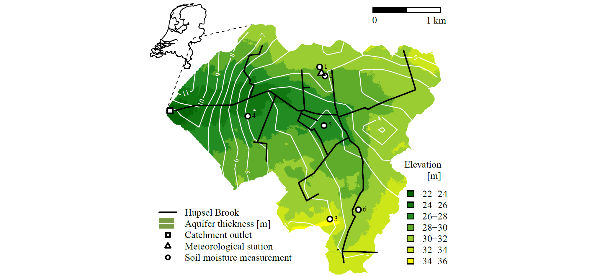

Module 8: Spatial data
---

***Draw catchment map***

In this assignment, you will process and plot shapefiles and raster (ascii grid) data. Shapefiles are actually a collection of files together specifying the coordinates of a polygon (for the border of the Netherlands) or lines (for water courses). ascii files contain information about the resolution and coordinates, and a matrix with a value per grid cell. There are 3 ascii files: for the surface elevation, the elevation of the clay layer (bottom of the top aquifer) and a mask for the catchment area, which distinguishes between inside (1) and outside the catchment (NA). Finally, a regular data file contains coordinates for some specific locations.

1. Download the zip file `shapefiles_Hupsel.zip` and unzip it in a folder. Open the ascii files to see what they look like.
2. Initialize the script with standard headers and working directory. Add a line to load package `maptools`. You probably have to install this package first (you don't need to add that to the script, because you only have to do that once).
3. Use function `readAsciiGrid` to read the ascii data files (under `Data`). Add argument `as.image=TRUE` so it returns a list with components `x` ($x$-coordinates), `y` ($y$-coordinates) and `z` (matrix with elevation/mask per pixel).
4. Use function `image` to plot a first elevation map, using default colors and ranges (under `Output`).
5. Cut off the elevation map at the catchment boundary (under `Processing`). Use square brackets to replace the elements in the elevation-matrix with NA if that same element in the mask-matrix is NA. The elevation-matrix and mask-matrix are in fact the `z`-component in the lists. Use *A (very) short introduction to R* to find out how to check if a value is NA.
6. Make the plot again to see if everything works.
7. Above the plot, set all margins to zero.
8. Make a vector with 7 colors green, either by hand (google R color chart) or by using `colorRampPalette` for a calculated range.
9. Make a vector of length 8 with the break points of the color legend. For example, all pixels with elevation between the first and second break points will get the first color. Note that the elevations in the matrix are in cm above sea level.
10. Add the colors and break points as arguments to the `image` function.
11. Add the legend in the bottom right. Add the words `Elevation` and `[m]` manually with the function `text`.
12. Compute the thickness of the aquifer by subtracting the elevation of the clay layer from the elevation of the land surface (under `Processing`). The easiest way is to make a copy of the elevation-list and adapt the `z` element. Note that the clay elevations are in m above sea level.
13. Use function `contour` to add clay elevation as white lines. Use argument `add=TRUE` to plot it over the previous map and plot lines every 1 m.
14. Read the shapefiles with `readShapePoly` or `readShapeLines` (under `Data`). You only need one command to read all files starting with the same name together (ending with `.shp`).
15. Add the primary and secundary water courses as lines to the plot.
16. Read the file `coordinates.dat` (under `Data`).
17. Add the locations of the outlet, meteorological station and soil moisture observation locations as points to the plot. Use different symbols (`pch`) for different measurements. To get a white-filled triangle, plot a solid white triangle and plot an open black triangle over it. Use arguments `cex` and `lwd` to change the size of the symbols.
18. Add numbers to the soil moisture observation locations as text.
19. Add the legend in the bottom left. Make vectors for `pch`, `lty`, `lwd` and `col` with NAs when that value does not apply.
20. Plot a green rectangle behind the white line for the aquifer thickness.
21. Add a scale bar with rectangles and text.
22. Add a small plot of the Netherlands:
    1. Below the map you already created, you will plot another map, but only using the top left part of the plotting area. Add `par(fig=c(...), ...)`. Look in the help for `par` how to use the argument `fig` to reduce the plotting area.
    2. Plot the map of the Netherlands with `plot`. Use `bg="transparent"` to avoid white overlaying the map. 
    3. Before the `fig` command, add dashed lines from the location in the Netherlands to the corners of the large map.
23. Add code above and below the figure to save it as pdf.

*Hupsel Brook catchment. Figure source: C.C. Brauer, A.J. Teuling, P.J.J.F. Torfs, and R. Uijlenhoet (2013): Investigating storage-discharge relations in a lowland catchment using hydrograph fitting, recession analysis, and soil moisture data, Water Resour. Res., 49, 4257-4264, onlinelibrary.wiley.com/doi/10.1002/wrcr.20320/pdf.*
